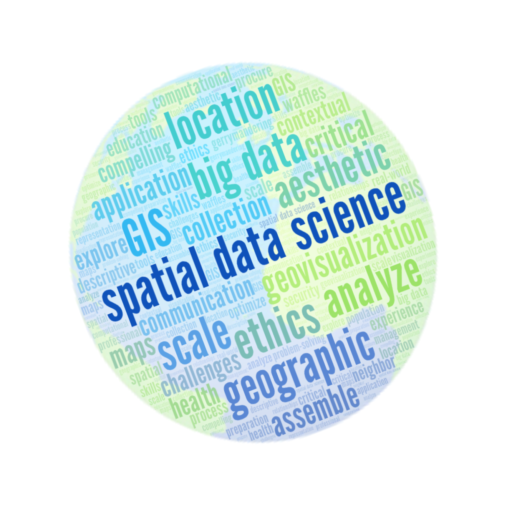

```{r, echo=FALSE, message=FALSE, warning=FALSE}
wk1.date <- as.Date("2019-08-26")
```

This course will introduce students to data science with a focus on spatial (geographic) data, which are data that are referenced to a particular location on Earth's surface.  Students will learn concepts, techniques, and tools they need to apply various facets of data science practice, including data collection, management, and integration, descriptive modeling, exploratory spatial data analysis, and effective communication via data visualization and mapping.  Real world examples and datasets spanning physical, social, and health sciences will be used throughout the course in an effort to promote contextual learning.




<span style="color:red">**Instructor**</span> 

> OH for Finals Week: All hours will be held in Holt 202   
- Mon: 9-10am, 2-3pm  
- Tue: 10:30-11:30, 8-9pm  (Zoom link in Slack)
- Wed: 9:30-11am   


