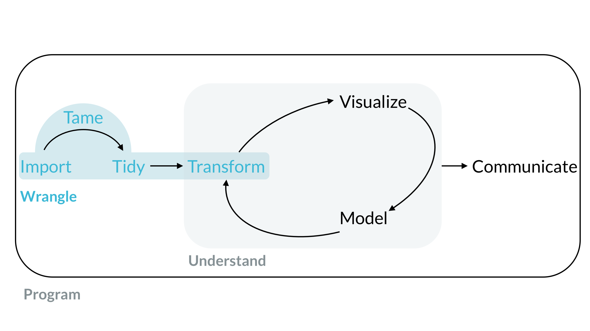
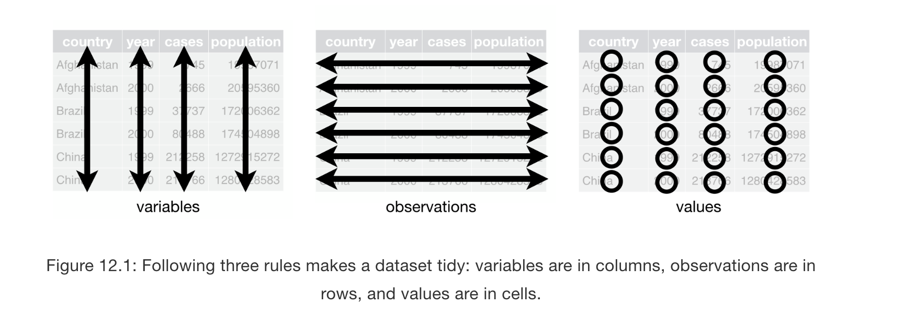

```{r setup, include=FALSE}
options(htmltools.dir.version = FALSE)
knitr::opts_chunk$set(warning = FALSE, message = FALSE, 
  comment = NA, dpi = 300,
  fig.align = "center", out.width = "70%", cache = FALSE)
library(tidyverse)
library(here)
library(knitr)
#library(emo)
library(extrafont)
# ggplot2::theme_set(theme_minimal())
# update those defaults
update_font_defaults <- function(font_choice = "Lato") {

    ggplot2::update_geom_defaults("text", list(family = font_choice))
    ggplot2::update_geom_defaults("label", list(family = font_choice))
    
}

theme_bakeoff <- function(font_choice = "Lato"){ 
  
  update_font_defaults()
  
  ggplot2::theme_minimal(base_family = font_choice)
  
}
ggplot2::theme_set(theme_bakeoff())
```
# Today's Class

--

## The Fun Part

---

# Today's Class

## The Fun Part (Almost)

- ### Taming --> Tidying --> Transforming

--
## Next class
- #### Visualize
- #### Explore
- #### Repeat

---
class:middle, inverse, center

```{r echo = FALSE}

```

---
# Taming Your Data

### Parsing/Casting your columns
- #### Making sure data is in the correct format
  - Categories are factors/character
  - Quantititative variables are numeric
  - Dates are dates
  
- #### Commands from `readr` package
  - parse eg. `parse_number()`
  - casting eg. `col_number()`

---
# Taming Your Data

### Recoding Values
- #### Making sure values in columns are correct
  - eg. Yes = 1, No = 0
- #### Switch from continuous to discrete
  - eg. Changing Income values to high,medium,low
- #### Useful to create dummy variables (0,1) (absence/presence)

- #### Commands from `dplyr` package
  - parse eg. `recode` to factor using `recode_factor()`
  - frequently within `mutate`
  
---
# Taming Your Data

### Selecting columns
- #### Making sure only relevant columns are included in dataset
  - eg. drop irrelevant/intermediate columns
- #### Make sure columns are in correct order
  - eg. Eg - all grouping columns together, all thematic columns together
- #### Useful to create dummy variables (0,1) (absence/presence)

- #### Commands from `dplyr` package
  - select eg. `select` function 
  - reorder variables using `select` and helper functions

---
# Taming Your Data

### Reformatting and Renaming Variable Names
- #### Makes sure variable names make sense
  - eg. Total cases of disease vs percent of population with disease is reflected in column names
- #### variable names are consistent
  - eg. No foreign characters, consistent cases, no spaces etc

- #### Commands from `dplyr` and `janitor` package
  - clean variable names using `clean_names` from `janitor` package
  - rename using `rename` from `dplyr`. often used with `select` for reordering and keeping new variables 
  
---
class: middle, inverse, center

```{r echo = FALSE}

```
--

#tame data $\neq$ .shout[tidy data]

---
# Tidy Data

> “Happy families are all alike; every unhappy family is unhappy in its own way.” –– Leo Tolstoy

--

> “Tidy datasets are all alike, but every messy dataset is messy in its own way.” –– Hadley Wickham (inventor of Tidyverse)

--
### Three Cardinal Rules of a tidy dataset
- Each variable must be its own column
- Each observation must have its own row
- Each value must have its own cell

---
class: middle, inverse, center

```{r echo = FALSE}

```

--

### Put each dataset in a tibble (or data frame)
### Put each variable in a column

---
class: inverse 
# Which one out of these is tidy:

.pull-left[
```{r echo = FALSE}
knitr::include_graphics("img/tidy1.png",dpi = 150)
knitr::include_graphics("img/tidy2.png",dpi = 150)
```
]

.pull-right[
```{r echo =FALSE}
knitr::include_graphics("img/tidy3.png",dpi = 150)
knitr::include_graphics("img/tidy4.png",dpi = 150)
```
]

---

# Making data Tidy

## `pivot_longer()`
 - Wide format to long format
 - succeeds `gather()`

```{r eval =FALSE}
table4a %>% 
  pivot_longer(c(`1999`, `2000`), names_to = "year", values_to = "cases")
```

```{r echo =FALSE}
knitr::include_graphics("img/tidy_long.png",dpi = 150)
```

---
# Making data Tidy

## `pivot_wider()`
 - long format to wide format
 - succeeds `spread()`

```{r eval =FALSE}
table4a %>% 
  pivot_longer(c(`1999`, `2000`), names_to = "year", values_to = "cases")
```

```{r echo =FALSE}
knitr::include_graphics("img/tidy_wide.png",dpi = 150)
```

---
# Making data Tidy

## `separate()`
 - *break up* *single* column to *multiple* columns
 - To ensure that each value is its *own* cell

```{r eval =FALSE}
table3 %>% 
  separate(rate, into = c("cases", "population"), convert = TRUE)
```

```{r echo =FALSE}
knitr::include_graphics("img/tidy_separate.png",dpi = 150)
```

---
class: inverse
# Another untidy table

```{r echo =FALSE}
knitr::include_graphics("img/table5.png",dpi = 300)
```

---
# Making data Tidy

## `unite()`
 - *Combines* *multiple* columns into a *single* column
 - To ensure that each value is its *own* cell

```{r eval =FALSE}
table5 %>% 
  unite(new, century, year, sep = "")
```

```{r echo =FALSE}
knitr::include_graphics("img/tidy_unite.png",dpi = 150)
```

---
# Tidy Data Tips

### Tidy data is the start of your data wrangling journey, not the end
  - There is not a single “tidy” version of a dataset

### Not all non-tidy is incorrect, bad, or not-useful
  - May have better space or performance advantages
    - Eg. Big issue with spatial data (sometimes)
  - Some fields/data have their own useful conventions
  - All data can be fit in rectangular structures
      - genomic data
      - Corpus of texts
       - Network/graph datasets
---

class: middle, inverse, center

```{r echo = FALSE}

```
# TRANSFORMING DATA

---
## The `famous 5` verbs of `dplyr`

- `arrange`
- `select`
- `filter`
- `mutate`
- `summarize`

### Other important transformation variables

- #### group_by() , ungroup
  - often used with the famous 5
- #### join commands
  - combining multiple datasets/tables

---

class: middle, inverse, center
# Use cheatsheets often

<https://rstudio.com/resources/cheatsheets/>


---
# Next Class

- #### Data Visualization (spatial and non-spatial)
  - email a few visualizations, we will scrutinize them
- #### Lab 3/HW 1 doubts
- #### Fill in polleverywhere Area of interest survey (LAST CHANCE)

---


