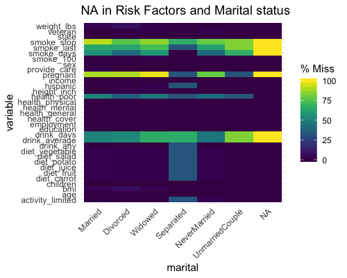
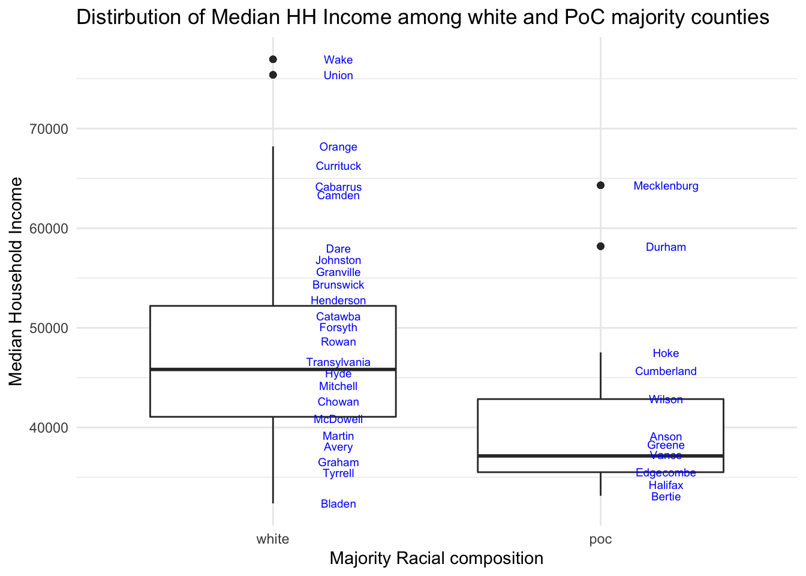

```{r setup, include=FALSE}
options(htmltools.dir.version = FALSE)
knitr::opts_chunk$set(warning = FALSE, message = FALSE, 
  comment = NA, dpi = 300,
  fig.align = "center", out.width = "70%", cache = FALSE)
library(tidyverse)
library(here)
library(knitr)
#library(emo)
library(extrafont)
# ggplot2::theme_set(theme_minimal())
# update those defaults
update_font_defaults <- function(font_choice = "Lato") {

    ggplot2::update_geom_defaults("text", list(family = font_choice))
    ggplot2::update_geom_defaults("label", list(family = font_choice))
    
}

theme_bakeoff <- function(font_choice = "Lato"){ 
  
  update_font_defaults()
  
  ggplot2::theme_minimal(base_family = font_choice)
  
}
ggplot2::theme_set(theme_bakeoff())

library(tidyverse)
library(RColorBrewer)
nc_tidy1 <- read_rds("nc_tidy1.rds")
nc_wide <- read_rds("nc_wide.rds")
```
# Today's Class

--

## The Fun Part

---

# Today's Class

## The Fun Part (For real)

- #.shout[Data Visualizations]

---
class:middle, inverse, center

#WHY VISUALIZE DATA

---
# A motivating Example

```{r echo = FALSE}
knitr::include_graphics("img/Anscombe's_quartet_1.svg")
```

---
# A motivating Example

```{r echo = FALSE, out.width= "50%"}
knitr::include_graphics("img/whyViz2.png",)
```
.footnote[*Source:* Jackson, 1980: *American Sociological Review*]

---
class:middle, inverse, center

#WHY VISUALIZE CORRECTLY

---
# Bad Taste

```{r echo = FALSE, out.width= "50%"}

```
.footnote[*Source:* Media Matters for America]

---
# Your Turn (figure 1)


```{r echo = FALSE, out.width= "70%"}

```
.footnote[*Source:* Yahoo Finance]

---
# Your Turn (figure 2)


```{r echo = FALSE, out.width= "70%"}

```
.footnote[*Source:* http://www.pbs.org/now/shows/305/homeless-map.html]

---
class:middle, inverse, center

#WHY VISUALIZE NICELY?

---
# Bad Perception

```{r echo = FALSE, out.width= "70%"}


```
.footnote[*Source:* http://socviz.co/lookatdata.html#why-look-at-data]

---
### Pick your battles or Risk Sensory Overload

```{r echo = FALSE, out.width= "70%"}

```
.footnote[*Source:* https://paldhous.github.io/ucb/2016/dataviz/week2.html#]

---
### Pick your battles or Risk Sensory Overload

```{r echo = FALSE, out.width= "70%"}

```
.footnote[*Source:* https://paldhous.github.io/ucb/2016/dataviz/week2.html#]

---
## What is the Purpose of visualization

#### Exploratory VS Explanatory visualization

```{r echo = FALSE, out.width= "70%"}

```
.footnote[*Source:* DataCamp, Rick Scavetta]

---
## What is the Purpose of visualization

#### Exploratory VS Explanatory visualization

```{r echo = FALSE, out.width= "70%"}

```
.footnote[*Source:* Jackie Wirz, from https://apreshill.github.io/data-vis-labs-2018/]

---
## Data Visualization for Exploratory Analysis

#### Data Cleaning

- Testing for obvious inconsistencies and errors in your data
- Think about what your data represents
  - Are there any missing values
  - Values out of range
  - Are there any outliers
  
---
## Data Cleaning

#### Detect Missing Data

```{r echo = FALSE, out.width= "70%"}

```

---
## Data Cleaning

#### Detect Outliers

```{r echo = FALSE, out.width= "70%"}

```

---
## Data Visualization for Exploratory Analysis

#### Looking for 'structure'/'signal' in the data/'noise'

--
- What "pops" out?

--
- Are there obvious patterns or is the data random

--
- Visualize data multiple ways to generate possible explanations to explore

--
- Iterate/Repeat/Update

---

### Think about the visualization based on the type of data/variable

```{r echo = FALSE, out.width= "70%"}

```
.footnote[*Source:* https://serialmentor.com/]

---

### Think about the visualization based on what you want to show

```{r echo = FALSE, out.width= "70%"}

```
.footnote[*Source:* https://paldhous.github.io/ucb/2016/dataviz/week2.html#]

---
class:middle, inverse, center

#Visualizing using ggplot2()

---
##  `ggplot2()`

#### Based on the Grammar of Graphics

- A graph is made of several **layers**

- Grammar (i.e mathematical and aesthetic rules define layers)

---
## ggplot2 layers

```{r echo = FALSE, out.width= "70%"}

```
--
For this class, we will mainly focus on:

- Data
- Aesthetics
- Geometries
- Facets

---
### Example:

#### Histogram

```{r echo = FALSE, out.width="50%"}
ggplot(data = nc_wide) +
  geom_histogram(aes(x = med_hh_income)) + theme_minimal()
```

```{r eval = FALSE}
ggplot(data = nc_wide) +
   geom_histogram(aes(x = med_hh_income)) + theme_minimal()
```

---
### Constructing a ggplot2

```{r eval = FALSE}
ggplot(data = <DATA>) + 
  <GEOM_FUNCTION>(mapping = aes(<MAPPINGS>))
```

1.Initialize the data

2. add (at least) one geometry — with +

3. specify required Aesthetics — with aes()

---
### Lets look at our histogram again

```{r echo = FALSE, out.width= "50%"}
nc_wide %>%
  ggplot(aes(x = med_hh_income)) + geom_histogram(col = "white",
                                                  binwidth = 1000) +
  theme_bw()
```

---
### Lets look at our histogram again

```{r echo = FALSE, out.width= "50%"}
nc_wide %>%
  ggplot(aes(x = med_hh_income)) + geom_histogram(col = "white",
                                                  binwidth = 10000) +
  theme_bw()
```

---
### Distributing categorical data

```{r echo = FALSE, out.width= "40%"}
nc_wide %>%
  ggplot() + geom_bar(aes(x = white_majority, fill = white_majority)) +
  theme_bw()
```


```{r eval = FALSE}
nc_wide %>%
  ggplot() + geom_bar(aes(x = white_majority, fill = white_majority)) +
  theme_bw()
```

---
### Aesthetics in ggplot2

- x
- y
- colour
- fill
- size
- alpha
- linetype
- labels
- shape

---
# Next Class

- #### Data Visualization 2 (including maps)
  - email a few visualizations, we will scrutinize them
- #### HW 1 doubts

---


