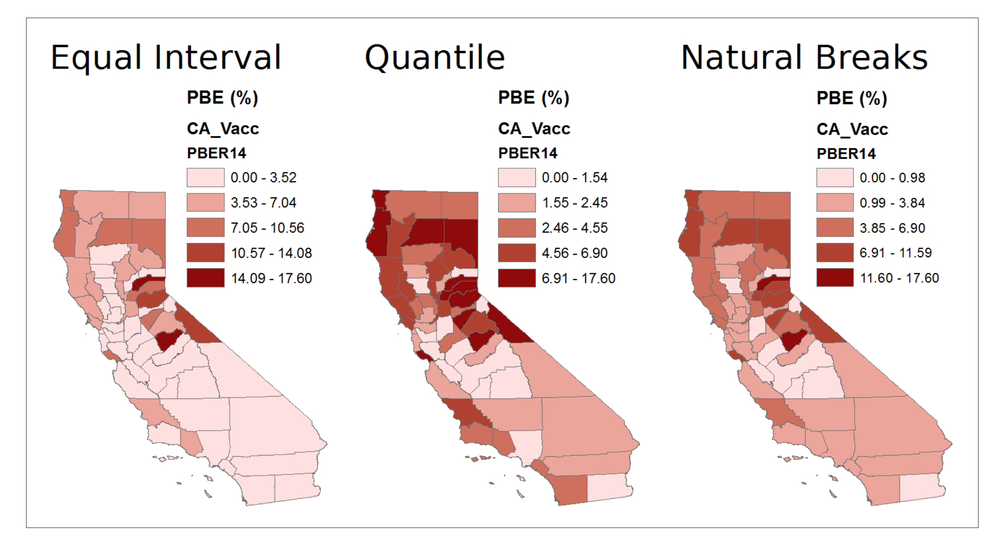
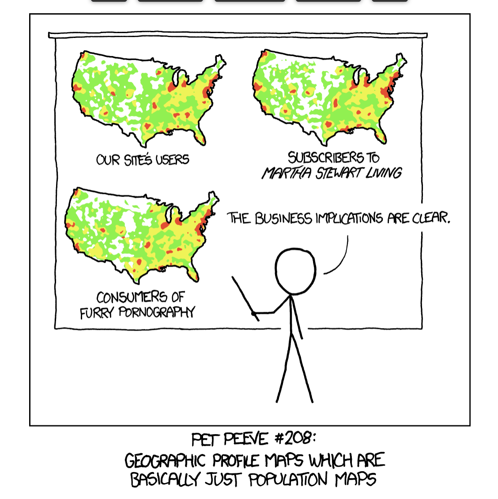

```{r setup, include=FALSE}
options(htmltools.dir.version = FALSE)
knitr::opts_chunk$set(warning = FALSE, message = FALSE, 
  comment = NA, dpi = 300,
  fig.align = "center", out.width = "70%", cache = FALSE)
library(tidyverse)
library(here)
library(knitr)
#library(emo)
library(extrafont)
library(sf)
library(janitor)
# ggplot2::theme_set(theme_minimal())
# update those defaults
update_font_defaults <- function(font_choice = "Lato") {

    ggplot2::update_geom_defaults("text", list(family = font_choice))
    ggplot2::update_geom_defaults("label", list(family = font_choice))
    
}

theme_bakeoff <- function(font_choice = "Lato"){ 
  
  update_font_defaults()
  
  ggplot2::theme_minimal(base_family = font_choice)
  
}
ggplot2::theme_set(theme_bakeoff())

library(tidyverse)
library(RColorBrewer)
nc_tidy1 <- read_rds("nc_tidy1.rds")
nc_wide <- read_rds("nc_wide.rds")
cafo_shp <- read_rds("cafo_shp.rds")
nc_wide1 <- nc_wide %>% mutate(name = str_to_upper(name))
#cafo_cnt <- cafo_shp %>% group_by(co_name) %>% summarize(b)
#cafo_shp <- 
nc_shp <- st_read("./data/NC_Counties/NC_Counties.shp",stringsAsFactors =F)
nc_shp <- nc_shp %>% clean_names(case = "snake")
nc_shp <- nc_shp %>% select(name = co_name, geometry) %>%
  mutate(name = name %>% str_to_title())

# join to tidy data
nc_tidy_geo <- nc_tidy1 %>% left_join(nc_shp, by = "name") %>% st_sf()
# join to wide data
nc_wide_geo <- nc_wide %>% mutate(name = name %>% str_replace(" County, North Carolina","")) %>% left_join(nc_shp, by = "name") %>% st_sf()

```

---
class:middle, inverse, center

> ## “The greatest value of a picture is when it forces us to notice what we never expected to see.” -John Tukey

---
# Today's Class

### Visualizing data multiple ways

  - #### Focus on seeing what pops out
  - #### Develop an intuition for visualizations

### Maps, Maps and Maps

---

# Recap

```{r echo = FALSE, out.width= "70%"}
knitr::include_graphics("img/whatyouwanttoshow.png")
```
.footnote[*Source:* https://paldhous.github.io/ucb/2016/dataviz/week2.html#]

---
# Let the data speak

```{r echo = FALSE, out.width= "50%"}

```
.footnote[*Source:* flowing data]

---
class:middle, inverse, center

# Lets make our data speak

---
# Distribution

#### What is the composition of my variable?
  - Are values concentrated/spread out
  - Are there any breaks/ outliers
  - Influences the questions you want to ask/ story you want to tell
  
---
# Distribution
#### Continous Variable
```{r echo = FALSE, out.width= "50%"}
nc_wide %>%
  ggplot(aes(x = med_hh_income)) + geom_histogram(col = "white",
                                                  binwidth = 10000) +
  theme_bw()
```

---
### Distribution
#### Continous Variable, multiple categories
```{r eval= FALSE}
nc_tidy1 %>% filter(race %in% c("white","black")) %>% 
  ggplot(aes(x = race_pct, fill = race)) + 
  geom_histogram(binwidth = 5 ,col = "white",
                 alpha = 0.3,position = "identity") + 
  scale_x_continuous(breaks = seq(0, 100, 5))+
  theme_bw()
```

```{r echo = FALSE, out.width= "40%"}
nc_tidy1 %>% filter(race %in% c("white","black")) %>% 
  ggplot(aes(x = race_pct, fill = race)) + 
  geom_histogram(binwidth = 5 ,col = "white",
                 alpha = 0.3,position = "identity") + 
  scale_x_continuous(breaks = seq(0, 100, 5))+
  theme_bw()
```

---
### Distribution
#### Continous Variable, multiple categories - density
```{r eval= FALSE}
nc_tidy1 %>% filter(race %in% c("white","black")) %>% 
  ggplot(aes(x = race_pct, fill = race)) + 
  geom_density(binwidth = 5 ,col = "white",
                 alpha = 0.3,position = "identity") + 
  scale_x_continuous(breaks = seq(0, 100, 5))+
  theme_bw()
```

```{r echo = FALSE, out.width= "40%"}
nc_tidy1 %>% filter(race %in% c("white","black")) %>% 
  ggplot(aes(x = race_pct, fill = race)) + 
  geom_density(col = "white",
                 alpha = 0.3,position = "identity") + 
  scale_x_continuous(breaks = seq(0, 100, 5))+
  theme_bw()
```

---
# Distribution
#### Categorical variable
```{r echo = FALSE, out.width= "40%"}
nc_wide %>%
  ggplot() + geom_bar(aes(x = white_majority, fill = white_majority)) +
  theme_bw()
```


```{r eval = FALSE}
nc_wide %>%
  ggplot() + geom_bar(aes(x = white_majority, fill = white_majority)) +
  theme_bw()
```

---
### Distribution

## Continuous variable, categorical variable
```{r eval= FALSE}
nc_tidy1 %>%
  ggplot(aes(x = white_majority,y=med_hh_income)) + 
  geom_boxplot()  +
  theme_minimal()
```

```{r echo = FALSE, out.width= "40%"}
nc_tidy1 %>%
  ggplot(aes(x = white_majority,y=med_hh_income)) + 
  geom_boxplot()  +
  theme_minimal()
```

---
# Relationship

#### Focus on co-variation
  - How do x and y vary together
  - Is there a trend?
  - *Correlation is not equal to Causation*
---

# Relationship

```{r eval= FALSE}
nc_tidy1 %>% filter(race == "black") %>%
  ggplot(aes(x = race_pct,y=med_hh_income)) + 
  geom_point()  + geom_rug() +
  theme_minimal()
```

```{r echo = FALSE, out.width= "40%"}
nc_tidy1 %>% filter(race == "black") %>%
  ggplot(aes(x = race_pct,y=med_hh_income)) + 
  geom_point()  + geom_rug() +
  theme_minimal()
```

---
# Relationship
#### Comparison between 2 categories
```{r eval= FALSE}
nc_tidy1 %>% filter(race %in% c("black","white")) %>%
  ggplot(aes(x = race_pct,y=med_hh_income)) + 
  geom_point()  + geom_smooth() + facet_wrap(~race) +
  theme_minimal()
```

```{r echo = FALSE, out.width= "40%"}
nc_tidy1 %>% filter(race %in% c("black","white")) %>%
  ggplot(aes(x = race_pct,y=med_hh_income)) + 
  geom_point()  + geom_smooth() + facet_wrap(~race) +
  theme_minimal()
```

---
# Comparison

#### Focus on spotting differences
  - Differences across categories
  - Differences across time
  - Differences across units


---

# Comparison
#### Differences across units

```{r eval= FALSE}
nc_wide %>% mutate(name = name %>% str_replace(" County, North Carolina","")) %>%
  ggplot(aes(y = reorder(name,med_hh_income),x=med_hh_income)) + 
  geom_point(color = "maroon") + labs(x = "Median Household Income",
                      y = "County Names",
                      title = "Median HH Income by County") +
  theme_minimal() + theme(axis.text.y = element_text(size = 6))
```

```{r echo = FALSE, out.width= "40%"}
nc_wide %>% mutate(name = name %>% str_replace(" County, North Carolina","")) %>%
  ggplot(aes(y = reorder(name,med_hh_income),x=med_hh_income)) + 
  geom_point(color = "maroon") + labs(x = "Median Household Income",
                      y = "County Names",
                      title = "Median HH Income by County") +
  theme_minimal() + theme(axis.text.y = element_text(size = 6))
```

---
# Comparison
#### Differences across categories
```{r eval= FALSE}
nc_tidy1 %>%
  ggplot(aes(x = white_majority,y=med_hh_income)) + 
  geom_boxplot()  +
  theme_minimal()
```

```{r echo = FALSE, out.width= "40%"}
nc_tidy1 %>%
  ggplot(aes(x = white_majority,y=med_hh_income)) + 
  geom_boxplot()  +
  theme_minimal()
```

---
# Composition

#### Focus on parts of a whole
  - Focus on relative percentages
  - Generally not on counts

---
# Composition

```{r echo = FALSE, out.width= "70%"}

```
.footnote[*Source:* Simon Halliday]


---
# Composition

```{r echo = FALSE, out.width= "70%"}

```
.footnote[*Source:* NYtimes]


---
# Composition

#### Save your pies for Dessert, Please!!!!!!!

```{r echo = FALSE, out.width= "70%"}

```
.footnote[*Source:* Stephen Few]

---
# Connection

#### Focus on connections
  - Who is connected to who?
  - Focus on the edge, rather than the vertex
  
  
---
# Connection
```{r echo = FALSE, out.width= "70%"}

```
.footnote[*Source:* Tiago Paez via medium]

---
class:middle, inverse, center
## Location
---

# Why do we create maps

### Allows for visual interpretation of geographic patterns of phenomena

  - #### Location of objects/events
    - Themselves (e.g., clustered? where?) 
    - Or, in relation to other things
  - #### Variation of a type or value
    - Categories
    - Quantities

---
# Map Types

  - #### Point map
  - #### Proportional Symbol map
  - #### Choropleth map
  
---
# Point Map

#### Variable of interest is represented as set of point features

  - e.g., disease events, facilities, wells
  
#### Symbology is held constant (all points have the same shape, color, and size)

  – Visual interpretation of the density of events (per area) via the locations of points on the map
  
---
# Point Map
```{r eval = FALSE}
ggplot() + geom_sf(dat = nc_shp) +
  geom_sf(data = cafo_shp,
          col="red",alpha=0.4) + coord_sf(datum = NA) +
  theme_minimal() 
```

```{r echo = FALSE, out.width= "70%"}
ggplot() + geom_sf(dat = nc_shp) +
  geom_sf(data = cafo_shp,
          col="red",alpha=0.4) + coord_sf(datum = NA) +
  theme_minimal() 
```

---
 # Proportional Symbol Map

#### Variable of interest is represented as set of
point features, with interval/ratio
information
  
  - e.g., number of disease cases
  
####Size of symbol is scaled proportionally to the value of the attribute

---
# Proportional Symbol Map

```{r eval = FALSE}
ggplot() + geom_sf(dat = nc_shp) +
  geom_sf(data = cafo_shp %>% mutate(allowable_count > 0), aes(size = allowable_count),
          col="maroon",alpha=0.7) + coord_sf(datum = NA) +
  scale_size_area() +
  theme_minimal() 
```

```{r echo = FALSE, out.width= "70%"}
ggplot() + geom_sf(dat = nc_shp) +
  geom_sf(data = cafo_shp %>% mutate(allowable_count > 0), aes(size = allowable_count),
          col="maroon",alpha=0.7) + coord_sf(datum = NA) +
  scale_size_area() +
  theme_minimal() 
```

---
# Choropleth Map

#### Variable of interest represented by
ratios/rates/proportions located within
areal features (polygons)

- We generally do not use counts
- Areas are shaded with different colors, patterns, or intensities
  - Shows geographic variation
  - Requires classifying or binning the data values

---
# Choropleth Map

Lets look at examples from lab 3

---
# Choropleth Map

#### Data Classifcation

  - Our eyes are not good at discerning more than 6- 8 different shades of color in one map
  - Values (attribute that is being mapped) are classifed or binned into classes
  - Each class is assigned a specifc color along a color ramp
    – Value or Saturation sequence
    
---
# Choropleth Map

#### Data Classifcation
```{r echo = FALSE, out.width= "70%"}
  
```
.footnote[*Source:* Paul Delamater]

---
## Is your data really spatial?

 - What are you interested in?

    - Are you interested in the units of interest?
    - Or, are interested in the geographic distribution of those units of interest

---
## Is your data really spatial?

```{r echo = FALSE, out.width= "70%"}
  knitr::include_graphics("img/spatial.png")
```
.footnote[*Source:* Kieran Healy]
 
---
## Is your data really spatial?

```{r echo = FALSE, out.width= "70%"}
  knitr::include_graphics("img/non-spatial.png")
```
.footnote[*Source:* Kieran Healy]

---
# Choropleth Map

```{r echo = FALSE, out.width= "70%"}
  
```
.footnote[*Source:* xkcd]

---
# Choropleth Map

#### Ur-choropleth Maps

```{r echo = FALSE, out.width= "70%"}
  
```

---
# Choropleth Map

#### Ur-choropleth Maps

```{r echo = FALSE, out.width= "70%"}
  knitr::include_graphics("img/af_am.png")
```

---
# Choropleth Map

#### Example
```{r echo = FALSE, out.width= "70%"}
  
```

---
# Cartograms

```{r echo = FALSE, out.width= "70%"}
  
```
---