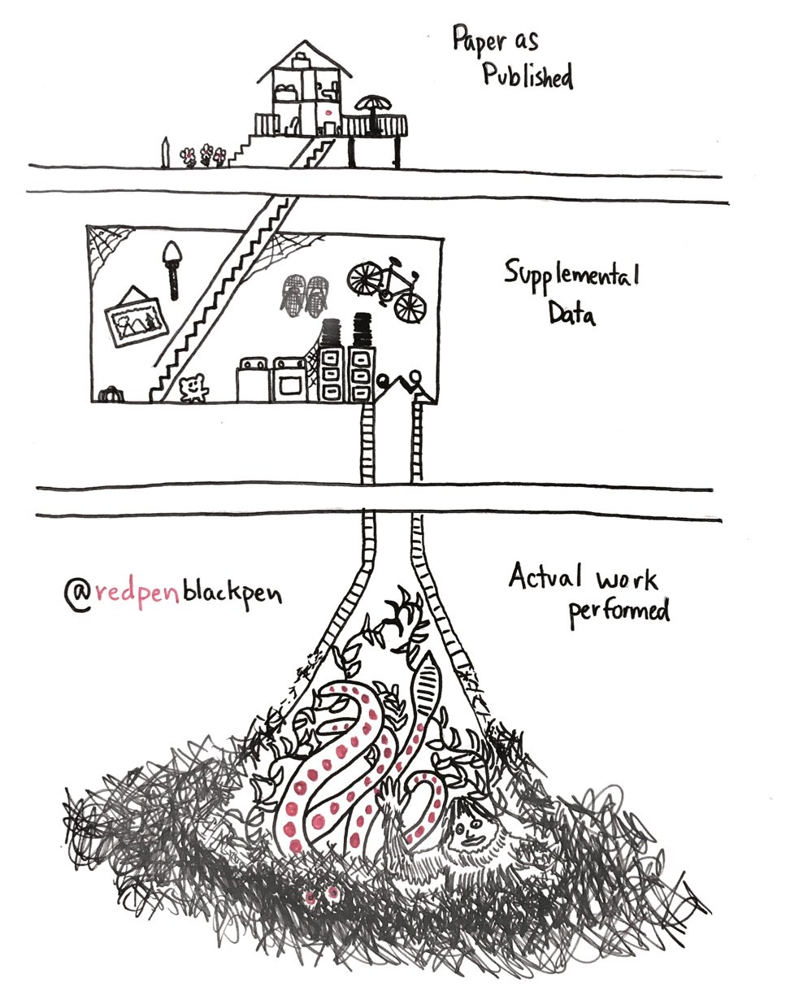
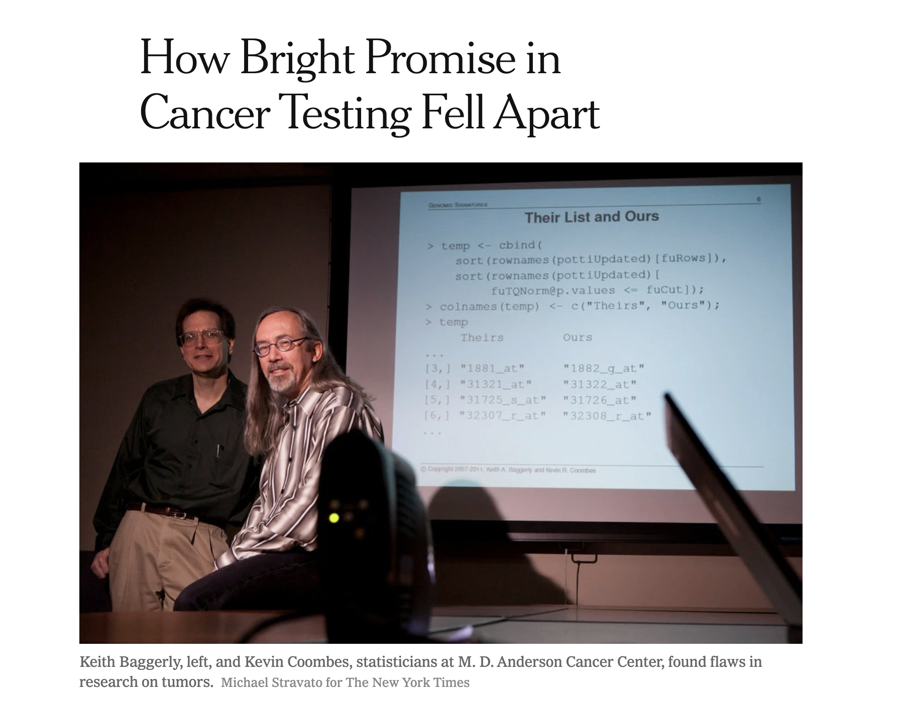
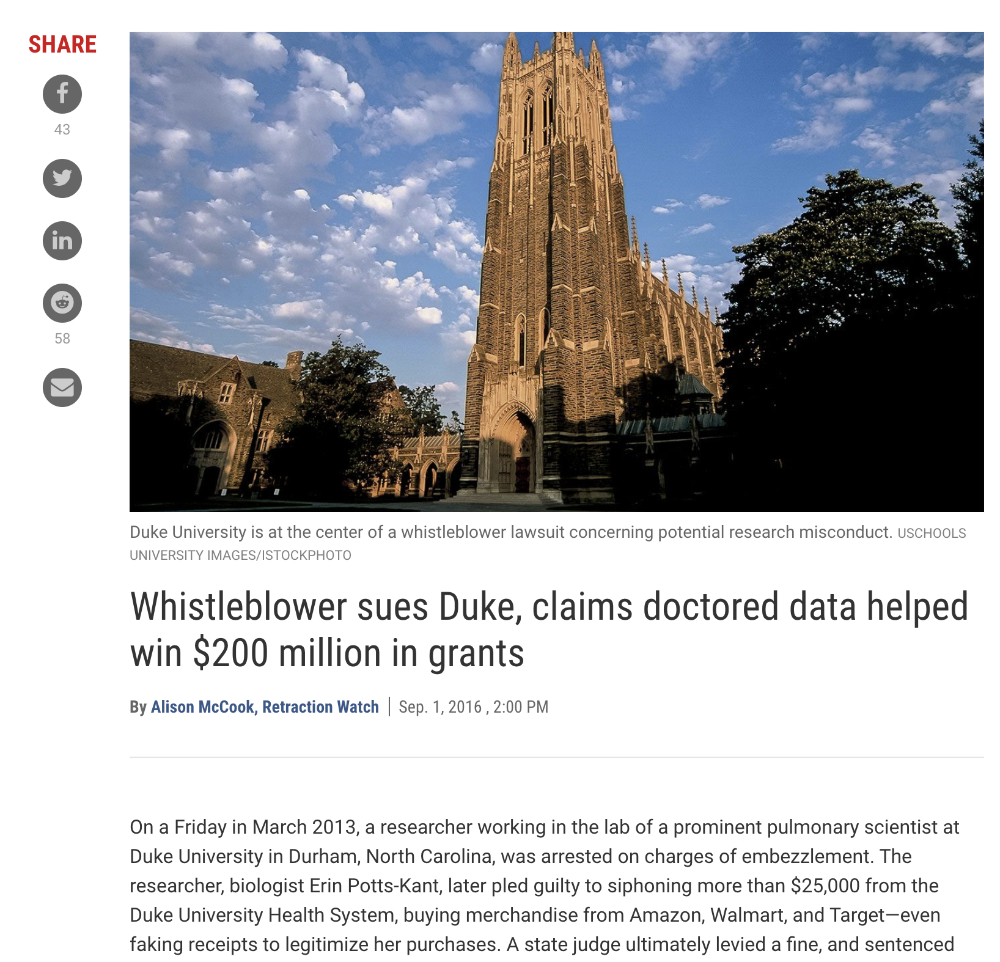
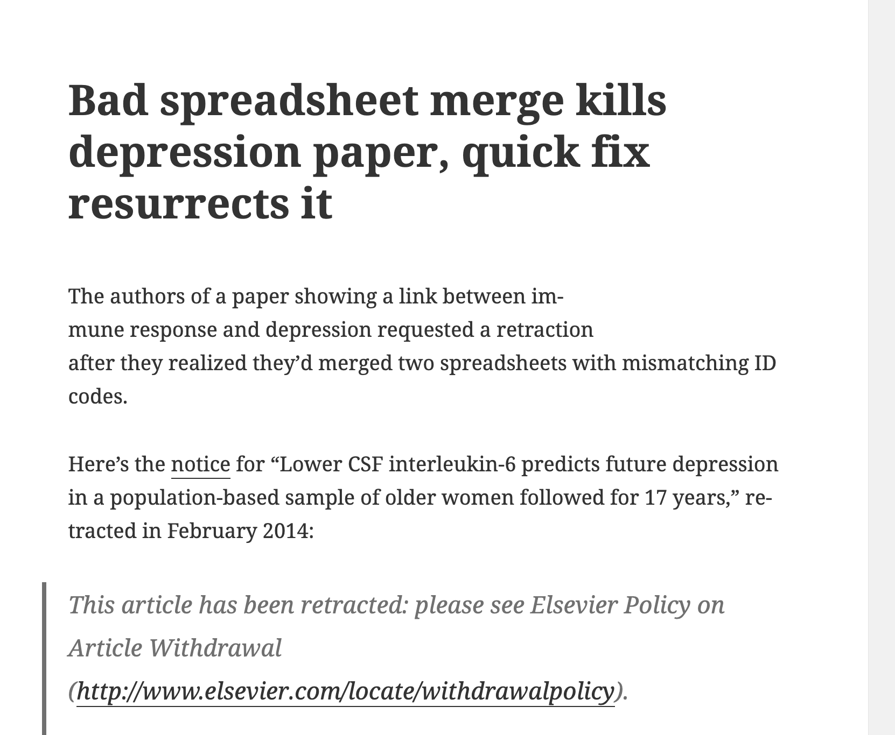
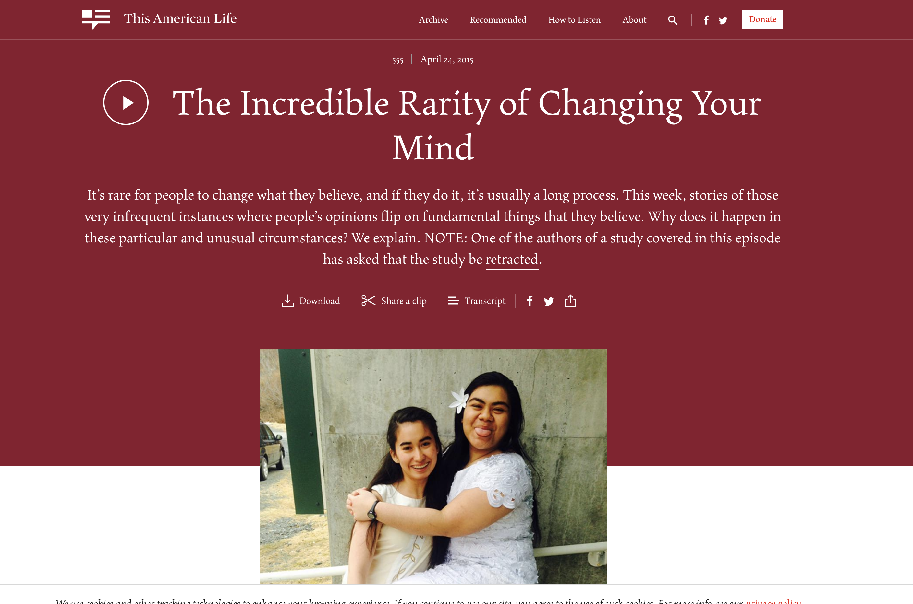
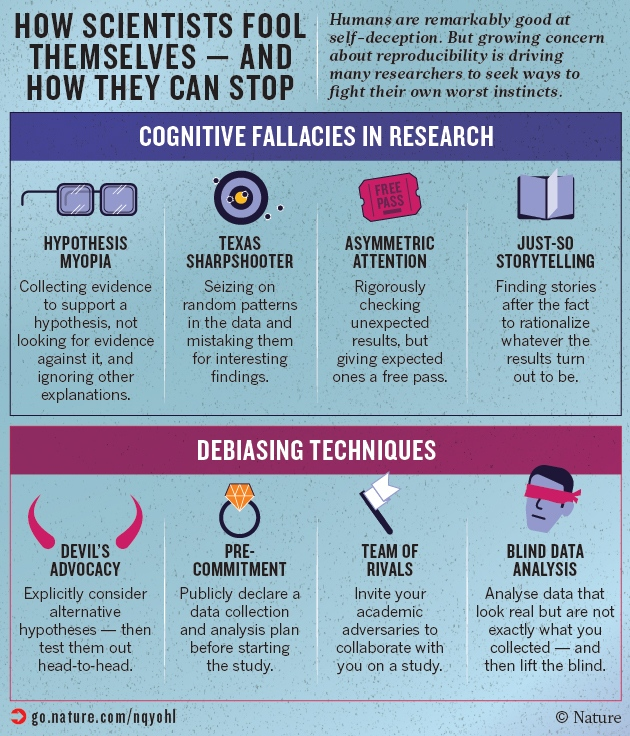
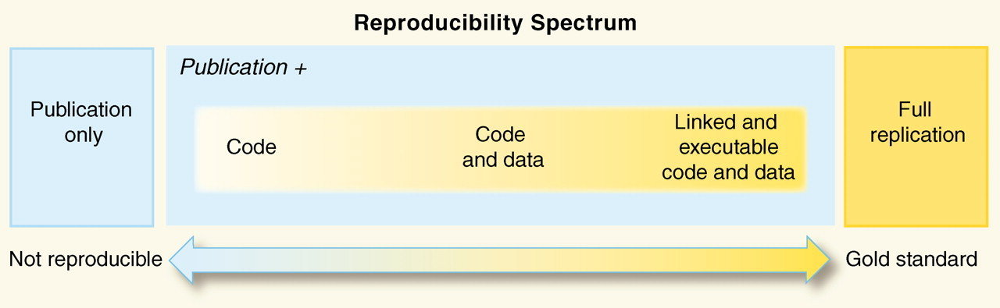
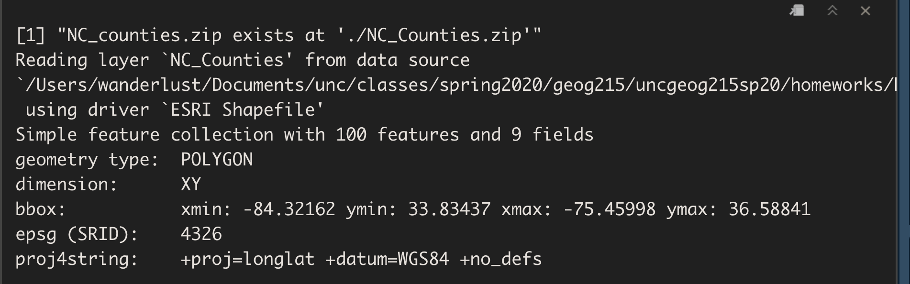

```{r setup, include=FALSE}
options(htmltools.dir.version = FALSE)
knitr::opts_chunk$set(warning = FALSE, message = FALSE, 
  comment = NA, dpi = 300,
  fig.align = "center", out.width = "70%", cache = FALSE)
library(tidyverse)
library(here)
library(knitr)
#library(emo)
library(extrafont)
library(sf)
library(janitor)
# ggplot2::theme_set(theme_minimal())
# update those defaults
update_font_defaults <- function(font_choice = "Lato") {

    ggplot2::update_geom_defaults("text", list(family = font_choice))
    ggplot2::update_geom_defaults("label", list(family = font_choice))
    
}

theme_bakeoff <- function(font_choice = "Lato"){ 
  
  update_font_defaults()
  
  ggplot2::theme_minimal(base_family = font_choice)
  
}
ggplot2::theme_set(theme_bakeoff())

library(tidyverse)
nc_wide <- read_rds("nc_wide.rds")
nc_tidy <- read_rds("nc_tidy1.rds")
```


---
# Today's Class

### Reproducible Research
  - #### Motivation
  - #### What is it?
  - #### Why is it important?
  - #### How to do it?

### Midterm logistics

---
### Reality of Scholarly Communication
```{r echo = FALSE, out.width= "50%"}

```

---
# Scholarly communication

#### Traditional modes of communication of analytical results are:

  - Manuscripts
  - Reports
  - Presentations
  - Posters
  - Websites
  - Dashboards

---

# Purpose of scholarly communication

  - #### To report what you’ve **actually** discovered, **clearly enough** that **someone else can discover it for themselves**.
  
    - #### To make it easier for readers to understand what you did
  
    - #### ***To make it easier for readers to replicate/reproduce what you did***

---

# However....

#### Modern statistical software = "blackbox"

--

### Readers are supposed to focus on the final results

  - *and not the code that derived it*
  
---
class:middle, inverse, center

> # Should I even care about the code?

---
class:middle, inverse, center

> # YESSSSSSSSS!!! YOU SHOULD 

---
class:middle, inverse, center

> # I AM SERIOUS!!! YOU SHOULD

---
### Reproducibility crisis in science

#### Intentional mistakes
```{r echo = FALSE, out.width= "40%"}


```

---
### Reproducibility crisis in science

#### Unintentional mistakes

```{r echo = FALSE, out.width= "60%"}

```

---
### Influence on the public

```{r echo = FALSE, out.width= "80%"}

```

---
### Researchers (including you and me) are fallible too

```{r echo = FALSE, out.width= "50%"}

```

---
# Reproducible Research

- #### Original data and (computer code) can be re-analyzed by an independent investigator to obtain the same results

  - #### The analysis can be successfully repeated
  
  - #### Highly important in studies where computational analysis plays a large role

---
# Reproducible Research

- #### Expose more of the research workfow to our audience

  - Easier for them to make a more informed assessment of our methods and results
  
  - Easier for them to adapt our methods to their own research

---
# Reproducible Research

```{r echo = FALSE, out.width= "70%"}

```

---
# Reproducible Research

- Science moves forward when discoveries are **replicated** and **reproduced**

  - Many important scientific advancements have been incremental
  
  - Verifiability and reproducibility are among the cornerstones of the scientific process. 
  
  - They allow scientists to **"stand on the shoulder of giants".**
  
  - incremental + incremental + incremental .... ..... + incremental = *"Nobel Prize"*

---
### Replicable vs Reproducible

#### Replicable Research

  - If you *collected new data* and *performed the experiment again* or *answered the same question*, would you receive consistent results?
  
  - independent investigators use methods, protocols, data, and equipment to confirm scientific claims.
  
  - Often expensive, and tough to do as new settings can induce errors or differences
  
  - Replicable research is reproducible
---
### Replicable vs Reproducible Vs Correct Research

#### Reproducible Research

  - when data sets and computer code are made available for researchers to verify results
  
  - If you ran analysis on the same data using the same set of methods that the researcher specified, would you receive same results?
  
  - A study is reproducible if there is a specific set of computational functions/analyses (usually specified in terms of code) that exactly reproduce all of the numbers in a *published* paper from *raw* data
  
  - *Reproducible* is not necessarily *replicable*
  
  - *Reproducible/replicable* is not necessarily *correct*
  
    - The study could be poorly designed or executed but still be reproducible or replicable

---
# Why should I care?

- Avoid embarrassment

- Save time, in the long run

- Improves your mental health ! ! ! (ask me)

-  Show evidence of correctness
  - Allows for independent evaluation
  
- Greater potential for extension impact for your work
  - Others can build on your work/methods
  - You can build on your prior work

---
class:middle, inverse, center

> ### Your closest collaborator is you six months ago,
but you don't reply to emails.

---
# What could go wrong?

- "The attached is similar to the code we used."
- "Where did this data file come from?!"
- "Can you repeat the analysis, omitting subject X?"
- "This part of your script is now giving an error."

---
class: middle, inverse, center

### How to perform do reproducible research?

---
class: middle, inverse, center

### Good News!

--

### You already doing some of it

---
# Bad News

  - Importance is widely recognized, but not widely practiced

--

  - More start up time

--  

  - Not sent up for instant gratificiation

--

  - Takes a different mindset (Challenges our biases and in some cases, EGO!)

--
### However
- Will be outweighed by time saved later
- You can go back in time and fix errors with confidence
- Becomes easier with practice

---
# Basic Principles

  - Everything via code
  - Everything automated
  - Workflow and dependencies clearly documented
  - Get the data in the most-raw form possible
  - Get any/all data and meta-data possible
  - Keep track of the provenance of all data files
  - *Be self-sufficient

---
### Four facets of reproducibility

  - *Documentation*
    - Use markdown to document your workflow so that anyone can pick up your data and follow what you are doing
    - Use *literate programming* so that your analysis and your results are tightly connected, or better yet, unseperable

  - *Organization*
    - tools to organize your projects so that you don't have a single folder with hundreds of files

  - *Automation*
    - the power of scripting to create automated data analyses

  - *Dissemination*
    - publishing is not the end of your analysis, but paves way for future research.

---
class:middle, inverse, center

> ## YOU ARE ALREADY DOING ALL OF THIS

---
# Is this reproducible ?

- Open a an excile file to extract as CSV

--

- Open a csv file in word and delete first blank row

--

- Save your graph from R on your desktop and paste it in your markdown file

--

- Manually type in numbers/results in your Rmarkdown Document


--

- Submit your final project in word, and Paste results into the text 

---

## In future labs/assignments

- We will practice and assess how reproducible our analysis is

---
class:middle, inverse, center

> ### MID-TERMS LOGISTICS

---
# Midterm Exam Structure

- 15% of your grade
- Timed exam on Sakai
- Multiple choice, True and False, fill in the blanks, short answers
- Focus on both theory and programming skills
- Covers all material till (including) today.
- Lectures, labs, readings, data camp
- Distributed Thursday morning
- Take exam by March 4, 11:59 pm.
- You can study together, but no collaboration while taking exam
- Piazza will be paused during exam time

---
# Your resources

- Class materials (lectures, labs, readings, piazza, data camp)

- Your TA, me (for clarifying questions)

- Practice Questions (w answers)
  - We will go through some in class on Wednesday and some for you to practice on your own
  
- Wednesday's class
  - Send me any doubts you have about course material that you would like to be discussed by tomorrow night
  
---
# Examples

# Answer Qs based on screenshots:

```{r echo = FALSE, out.width= "50%"}

```

- How many attributes, and features are there?
- Is this a projected system ? True of False
- What does each observation represent?

---
# Answer Qs based on code:

```{r}
colnames(nc_wide)
newdat <- nc_wide %>% select(geoid:black, ends_with("n"))
```

#### Based on this code: what will be the dimensions of newdat ?

---
# Output type 1

```{r eval=F}
x <- c(1:6,5,NA,NA,10,5)
which(x >=5)
```

What will be the output?

  a. An error
  
  b. logical vector with 7 elements
  
  c. logical vector with 11 elements
  
  d. NA
  
  e. numerical vector with 7 elements
  
  f.numerical vector with 5 elements

---

---
# Output type 2

```{r eval=F}
x <- c(1:6,5,NA,NA,10,5)
which(x >=5)
```

What will be the output?

a. An error

b. FALSE TRUE NA NA TRUE TRUE

c. 5 6 7 10 11

d. 5 6 7 NA NA 10 11

e. 2 3 NA NA 6 7

f. 2 3 6 7

---
# Fill in the blanks: Type 1
```{r}
colnames(nc_wide)
```

```{r eval=F}
dat <- nc_wide %>% ______(med_hh_income > 10000) %>% 
  _______(name, people_of_color = poc) %>%
  ________(name)
```

fill in the blanks to get the data with poc greater 10000, with 2 columns sorted by poc in ascending order.

---
# Fill in the blanks: Type 2

```{r eval=F}
dat <- nc_wide %>% ______(poc > 1000) %>% 
  _______(name, poc) %>%
  ________(poc)
```

```{r echo = F}
nc_wide %>% filter(poc > 1000) %>% 
select(name, people_of_color = poc) %>%
arrange(people_of_color)
```

fill in the blanks to get the following dataset