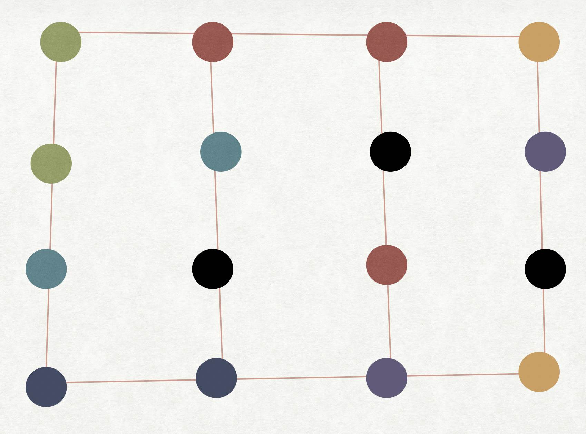

```{r setup, include=FALSE}
options(htmltools.dir.version = FALSE)
knitr::opts_chunk$set(warning = FALSE, message = FALSE, 
  comment = NA, dpi = 300,
  fig.align = "center", out.width = "70%", cache = FALSE)
```

```{r xaringan-themer, include = FALSE}
library(xaringanthemer)
solarized_light(
  header_h1_font_size = "45px",
  header_h2_font_size = "35px",
  header_h3_font_size = "25px",
  text_font_size = "20px",
  text_font_family = "sans-serif",
  header_font_family = "sans-serif",
  text_font_base = "sans-serif",
  text_bold_color = "maroon",
  extra_css = list(
    "h2, h4" = list(
      "color" = "#666666"
      #"line-height" = "0.5em"
),
"h3" = list(
      "color" = "maroon"
),
"h1" = list(
      "color" = "#002b36"
),
"li, p" = list(
     #"padding" = "0 0 0 2em",
     #"margin" = "0",
      "line-height" = "1"
)
# "ul, ol, dl" = list(
#      #"padding" = "0 0 0 2em",
#      #"margin" = "0",
#       "line-height" = "1"
# )
)
)
```
class: middle

> ## *“You can't connect the dots looking forward; you can only connect them looking backwards. So you have to trust that the dots will somehow connect in your future.”* - Steve Jobs
---

# Today's Class

--
## Connecting the dots

--
## Your Projects!!

--
## Exploratory (Spatial) Data Analysis
  
---
# What have we convered so far

```{r echo = FALSE, out.width= "70%"}

```
---
# Where are we moving to ?

```{r echo = FALSE, out.width= "70%"}

```

---
# Where are we moving to ?

```{r echo = FALSE, out.width= "70%"}

```

---
# Where are we moving to ?

```{r echo = FALSE, out.width= "70%"}

```

---
# Where are we moving to ?

```{r echo = FALSE, out.width= "70%"}

```

---
class: middle, center

# PROJECTS

---
# PROJECTS

## Tackle an interesting Problem/Question

--
### How can we prepare of the influx of refugees in the future from war or climate change?

--
### How can you manipulate road systems to improve community welfare?

--
### Does climate change have an effect on the mental health of farmers?

--
### How is transportation access related to food access, and how does this affect the health of a community? 

--
### How deforestation has increased through the years and its effect on climate change ?


---
# Break down your question

--

## You cant solve everything

--

  - ### Each data represents something *specific* about the problem

  - ### Each place has its own unique characteristics

  - ### Think about people (or animals, trees), **place**, (and time)

--  

## Example

 ### How does the food and the transportation in *North Carolina* affect childhood obesity rates?

---
# Break down your question

### Into smaller answerable questions

--

### Think about *what*, *which*, *where*
  - Where are grocery stores located? Where are convenience stores location
  - Which places, groups of people travel furthest to get food?
  - What is the dominant mode of transportation in each census Tract in north Carolina.

--

### Think about relationships, comparisons
  - What is the relationship between number of grocery stores and percentage of population having access to public transport?
  - As distance to a grocery store decreases, does childhood obesity increase
  - Are certain communities that are disproportionately exposed to obesogenic environments

---
# Find data

## Data-driven vs Theory Driven

--

  - ### Your question determines what data you need
  - ### Your data determines what questions you ask

--

## Construct Validity

  - ### THINKING about your data and what it represents
  - ### How well does the data/measurements you have capture the characteristic of the world you are interested in?
  
---
# Project Proposal ( Due March 18th)

## One page per group - Google Docs

  - Team Name
  - What questions will you try to answer? 
  
    - List 5-10 possible questions.
    
  - What datasets will you use? 
  - Take a first look at the dataset
  
    - Should be clean enough
    - Think about construct validity
    
  - What are some things you will do with the data to get at your questions? 
  
    - what are some plots/maps you might make?


---

# Project Report and Presentations

  - ### Draft Report Due (April 20)
  
  - ### Peer Review
  
  - ### Final Report Due (April 27)
  
  - ### Presentations (In-class, May 4th)
  
---
class: middle, center

# Exploratory (Spatial) Data Analysis

---
# Exploratory Data Analysis (EDA)

## EDA is essentially learning about our data

  - ### The more one knows about the data, the more effectively it may be used to develop, test and refine research questions
  - ### The goal is to develop an understanding of our data

## EDA is about finding patterns

  - ### What are the different ways *in which the dots could be connected* ?
    - There can be multiple reasons behind a pattern
    - You try to generate a list of possible reasons behind the pattern
    
---
# Exploratory Data Analysis (EDA)

## EDA can include

  - ### Data cleaning
  
    - Identify duplicates, missing data (NA)
  
  - ### Calculations and transformations
    
  - ### Graphs, plots, charts, maps
    
  - ### Descriptive statistics and statistical/mathematical models

---
# Exploratory Data Analysis (EDA)

## Using questions to guide the investigation of your data

### Two useful questions

  - #### What type of variation occurs within my variables?
  
    - Central tendency, dispersion, visualization

  - #### What type of variation occurs between my variables?
  
    - Visualization, correlation

---
# For Exploratory Spatial Data Analysis...

## Question can be extended...

  - ### What type of geographic variation occurs within my variables?
  
    - Maps, spatial autocorrelation, clustering
    
  - ### What type of geographic variation occurs between my variables
  
    - Spatial correlation, Bi-variate clustering, Comparative Maps

---
## A simulated but very real example

```{r echo = FALSE, out.width= "70%"}
knitr::include_graphics("img/spatial_correlation.png")
```

---
# From Aspatial to Spatial

## Spatial Inputs

## Spatial Analysis

## Spatial outputs

---
# Spatial Inputs

## Your spatial data for your analysis may not be directly available:

  - ### Often, you have to generate your own spatial inputs from given data
  
--

### Common Spatial Inputs:

  - ### Distance to/from an observation
  
  - ### Points in a polygon
  
  - ### Attributes of your neighbors/neighborhood
  
---
# Distance

- Distance based operations may include:

  - **Spatial query**
  
    - Select geographic features based on distance
     - Example, distance to health care facility
     
  - **Buffer**
  
    - Use distance to define area around a point, line, or polygon feature
    - Number of grocery stores within walking distance
    
  - **Identify neighbors**
  
    - Identify geographic features within a neighborhood
    - Whether a Cafo exists in my neighborhood
  
---
