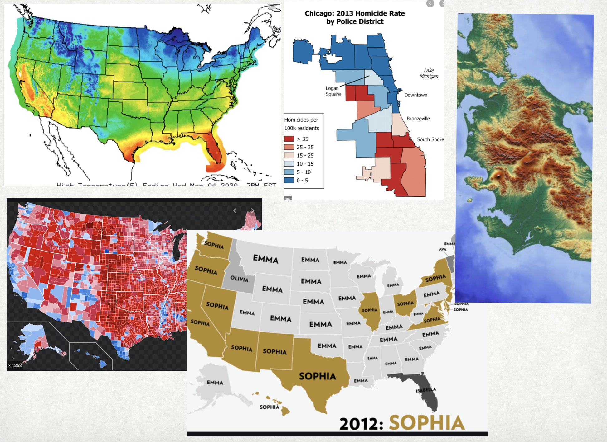
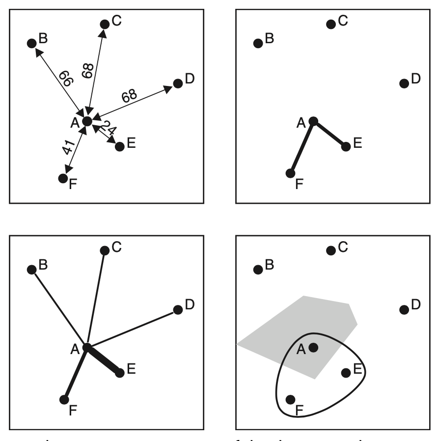
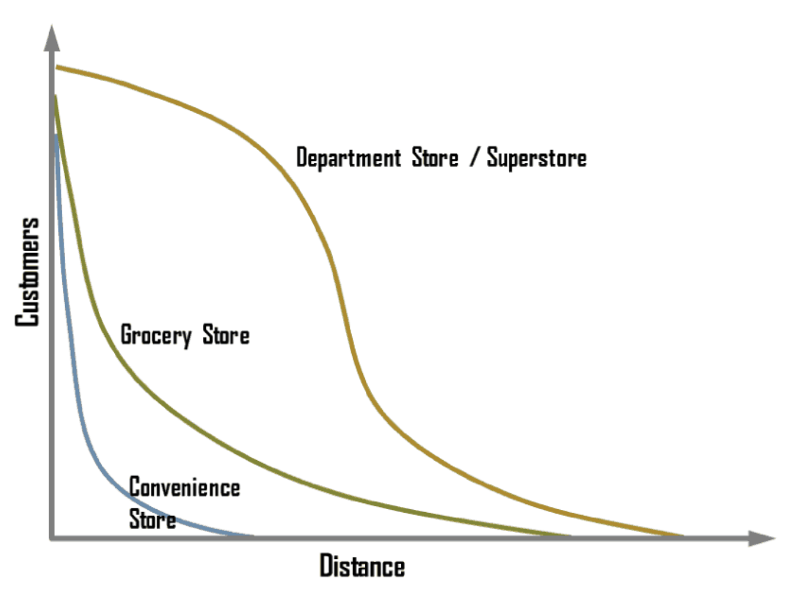
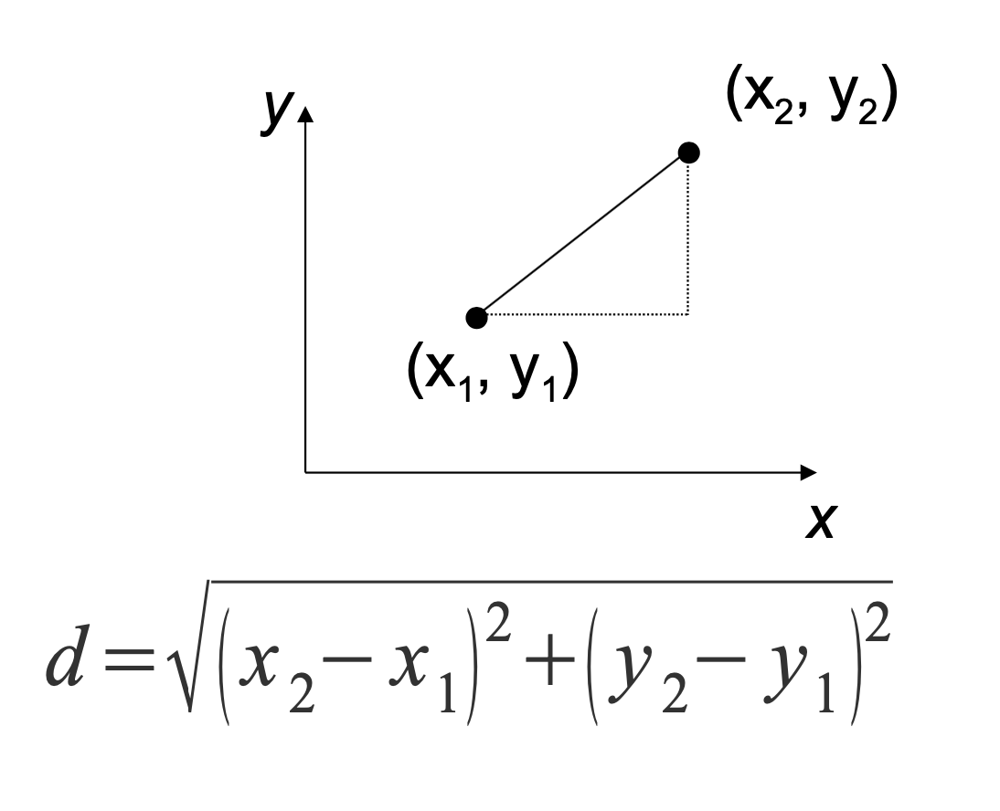
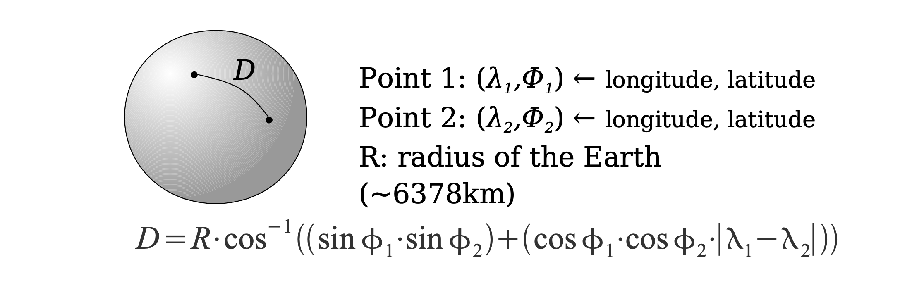
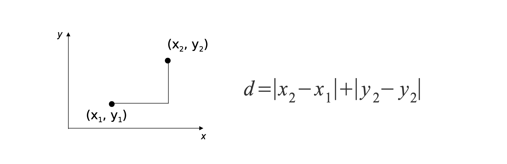
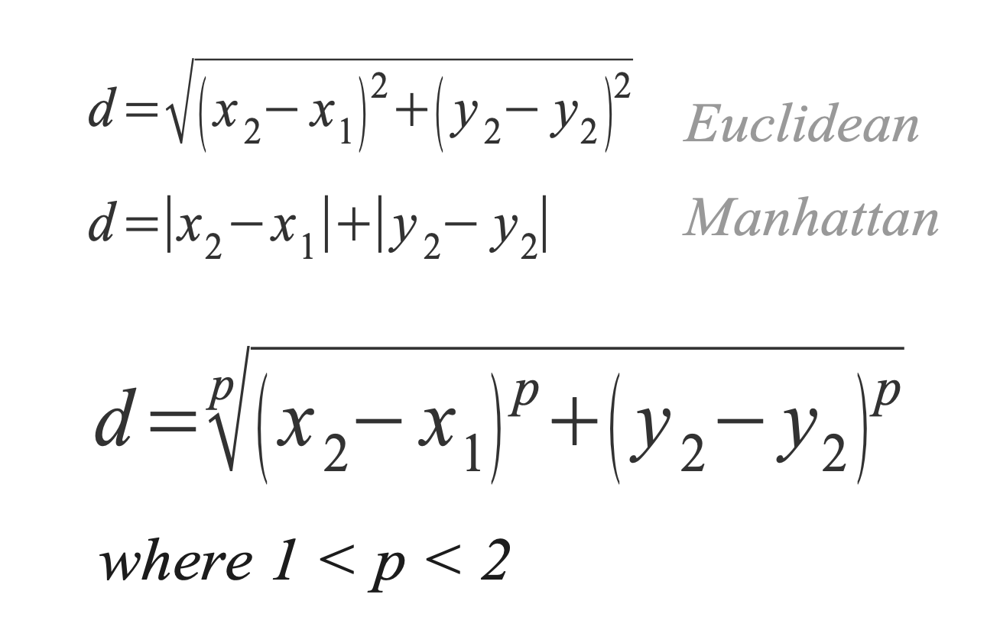
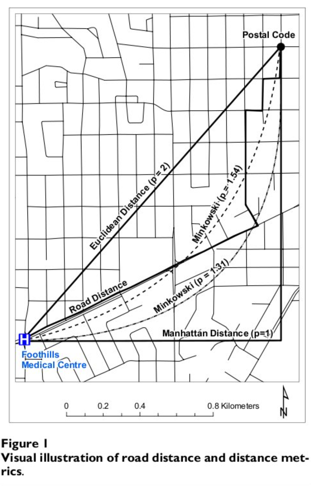
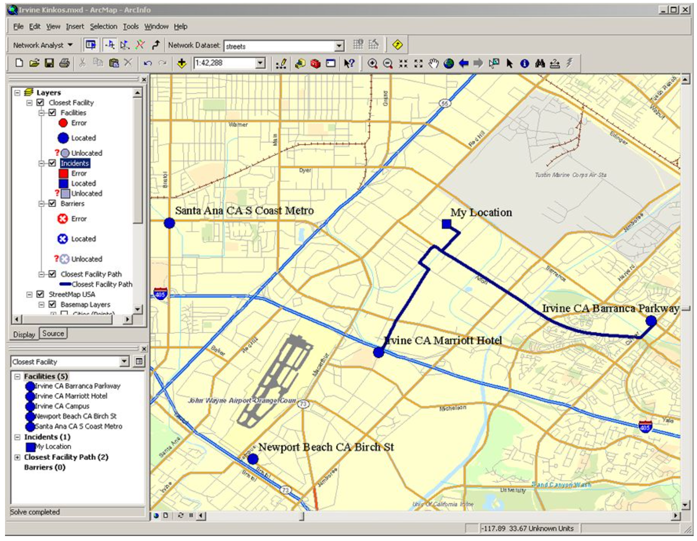

```{r setup, include=FALSE}
options(htmltools.dir.version = FALSE)
knitr::opts_chunk$set(warning = FALSE, message = FALSE, 
  comment = NA, dpi = 300,
  fig.align = "center", out.width = "70%", cache = FALSE)
```

```{r xaringan-themer, include = FALSE}
library(xaringanthemer)
solarized_light(
  header_h1_font_size = "45px",
  header_h2_font_size = "35px",
  header_h3_font_size = "25px",
  text_font_size = "20px",
  text_font_family = "sans-serif",
  header_font_family = "sans-serif",
  text_font_base = "sans-serif",
  text_bold_color = "maroon",
  extra_css = list(
    "h2, h4" = list(
      "color" = "#666666"
      #"line-height" = "0.5em"
),
"h3" = list(
      "color" = "maroon"
),
"h1" = list(
      "color" = "#002b36"
),
"li, p" = list(
     #"padding" = "0 0 0 2em",
     #"margin" = "0",
      "line-height" = "1"
)
# "ul, ol, dl" = list(
#      #"padding" = "0 0 0 2em",
#      #"margin" = "0",
#       "line-height" = "1"
# )
)
)
```
class: middle

> ## *“Everything is related to everything else, but near things are more related than distant things"* - Waldo Tobler
---

# Quick Recap from last class

## Exploratory (Spatial) Data Analysis

### Two questions to consider:

 - ### What type of geographic variation occurs *within* my variables?

 - ### What type of geographic variation occurs *between* my variables?


---
class: middle, center

# Why do we care?


---
# Tobler's First Law of Geography (TFL)

### "All things are related, but nearby things are more related than distant things"

- ### Spatial Dependence

  - What happens at one location is dependent on what happens at another location
  
- ### Underlines almost every physical and social phenomena

---
# Tobler's First Law of Geography (TFL) in Action

```{r echo = FALSE, out.width= "90%"}

```

---
# Tobler's First Law of Geography (TFL)

### "All things are related, but nearby things are more related than distant things"

- #### Spatial Dependence

  - What happens at one location is dependent on what happens at another location
  
- Underlines almost every physical and social phenomena

-  ### If TFL werent' true

  - #### GIS would be impossible
  - #### Life would be impossible
  - #### I will be out of work... :/

---

# In Exploratory Spatial Data Analysis

### We try to learn about spatial dependence/trends in our data

- ### What is the geographic variation within my variables
  - #### At what spatial scale does my data look similar/dissimilar
    - eg. Till what distance from a cafo do I see similar cancer rates ?
    - eg. Where are the outliers my in my data situated?
    - Can i predict missing data?
    
- ### What is the geographic variation between my variables
  - #### Are  2 variables spatially correlated?
    - eg - Do places with higher bednet coverage have lower rates of malaria? are there any places with high coverage of bednets, but still high malaria? 
    
---
## Quantifying Spatial dependence and relationships

  - ### **Distance**
  
  - ### Adjacency
  
  - ### Interaction
  
  - ### Neighborhood

```{r echo = FALSE, out.width= "40%"}

```

---
# Distance

- ### A fundamental geographic concept

  - #### Affects relationships and interactions among things and places
  
- ### Physical distance

 - #### Separation in either space or time 
 - #### Essential to understanding “space” 
 - #### As an effect and/or as an outcome!

---
# Distance

- ### Social Distance

 - #### Connection and isolation 
 - #### Formation of social networks
 
   - Are some subgroups more likely to interact or not?
   
   - Information dissemination
   
---
# Distance Decay

- ### Important concept in Geography

- ### Interaction (actual or potential) or relationship among phenomena decreases with increasing distance

  - #### Distance has “friction”
  
---
# Distance Decay

```{r echo = FALSE, out.width= "70%"}

```

### Can you think of other examples?

---
# Why Distance

### Distance is a fundamental geographic concept that affects relationships and interactions among phenomena
 
- ### Sometime we want to explain it
- ### Sometimes we want to measure it for input to other calculations
- ### Sometimes we want to map it

---
# Euclidean Distance

- ### Based on **Pythogoras Theorem**

  - $\ a^2 + b^2 = c^2$

- ### Assumes:
  - A planar Earth (Project CS)
  - No differences in elevation
  
- ### Does not require a GIS
  - Simple Math Calculation
  - #### Should not be used with latitude and longitude!!!

```{r echo = FALSE, out.width= "20%"}

```

---
# Euclidean Distance

## Limitations

- ### Assumes flat earth

  - Especially limiting over large distances
  
- ### Assumes no slope in terrain

  - Especially limiting in mountainous terrain
  
- ### Assumes no barriers to movement

  - Barriers can include anything that’s not a road (in the case of vehicular travel) or anything on the landscape that stands in the way

---
# Great Circle Distance

### Great circle distance is the shortest distance between two points on a sphere

  - #### Used for points stored in spherical coordinates
  - #### Required to calculate distance in spherical coordinates, especially if points are far apart
  
```{r echo = FALSE, out.width= "70%"}

```

---
# Manhattan Distance

- ### One way to account for barriers is to recognize that travel can be limited to transportation routes that follow cardinal directions (N, S, E, W)

  – #### In cities with a grid system
  
    - Eg. in Manhattan where most streets are at right angles

```{r echo = FALSE, out.width= "70%"}

```
---
# Minkowski Distance
.pull-left[
- ### Falls between Euclidean and Manhattan distance
- ### Distance of a curved arc connecting two points

```{r echo = FALSE, out.width= "50%"}

```

]

.pull-right[

```{r echo = FALSE, out.width= "70%"}

```
]


---
# Network Distance

.pull-left[
- ### Restricts travel along
existing arcs (lines)

  - #### e.g., on city streets
  
- ### Distance is the sum of the lengths of arcs that make up the route
- ### Available as an API from ESRI, open street maps etc. !
]

.pull-right[
```{r echo = FALSE, out.width= "100%"}

```
]

---
# Travel Time

### More accurate portrayal of human movement

- ### Requires travel network or travel surface

  - #### Available as an API from ESRI 
  - #### Can be computationally intensive
  
- ### Vehicular-based : US studies

  - #### Augmented using alternative travel modes
  
    - e.g., public transit, walking


---
# In what situation is Euclidean Distance Appropriate?

## POLL EVERYWHERE


---
# Networks and Distance

### In many cases, human movement is constrained to a network or network-like features


- #### **Point**: True “separation” among places should not be measured as straight lines, as this is not how people “overcome” distance

- #### **Counterpoint**: in some (many?) cases, Euclidean distances and network-based distances/times are highly correlated; hence Euclidean distances are a reasonable proxy

---
# Measuring Distance

### Basic approaches to measuring distance among things (for comparative purposes)

- ### Absolute distance

  - #### Based upon the actual distance separating them
  
- ### Relative distance

  - Nearest feature
  
    - #### The nearest feature is considered a neighbor, or
    - #### Or, nearest k features 
    
- ### Topology-based

- #### Connecting features are considered neighbors

---
class: center, middle, inverse

## FINISH MIDTERM (Quiz closes indefinitely on Friday 11:55 pm)

-- 

## Start thinking about project proposals

--

## Enjoy Spring-Break

--

## WASH YOUR HANDS, OFTEN!

---

# Distance based queries

- Distance based operations may include:

  - **Spatial query**
  
    - Select geographic features based on distance
     - Example, distance to health care facility
     
  - **Buffer**
  
    - Use distance to define area around a point, line, or polygon feature
    - Number of grocery stores within walking distance
    
  - **Identify neighbors**
  
    - Identify geographic features within a neighborhood
    - Whether a Cafo exists in my neighborhood
  
---
