```{r setup, include=FALSE}
options(htmltools.dir.version = FALSE)
```

```{r xaringan-themer, include = FALSE}
library(xaringanthemer)
solarized_light(
  header_h1_font_size = "45px",
  header_h2_font_size = "35px",
  header_h3_font_size = "25px",
  text_font_size = "20px",
  text_font_family = "sans-serif",
  header_font_family = "sans-serif",
  text_font_base = "sans-serif",
  text_bold_color = "maroon",
  extra_css = list(
    "h2, h4" = list(
      "color" = "#666666"
      #"line-height" = "0.5em"
),
"h3" = list(
      "color" = "maroon"
),
"h1" = list(
      "color" = "#002b36"
),
"li, p" = list(
     #"padding" = "0 0 0 2em",
     #"margin" = "0",
      "line-height" = "1"
)
# "ul, ol, dl" = list(
#      #"padding" = "0 0 0 2em",
#      #"margin" = "0",
#       "line-height" = "1"
# )
)
)
```
class: center, middle

> # *If I cease searching, then, woe is me, I am lost. That is how I look at it - keep going, keep going come what may* - Vincent Van Gogh
---

# What have we covered so far

- ### R introduction and basic commands
- ### How to execute R commands and communicate results
  - #### Console : Experimentation ***(Cooking)***
  - #### Scripts : Storing what works ***(Recipe for internal use)***
  - #### RMarkdown : Communicating to others ***(Cookbook)***
- ### Tidyverse in Action (Bushfires example)
- ### Representing Location and spatial data
  
---
class: center, middle

# Where is the Spatial Data at ?

--

# How to do I Acquire / get Access to it?

--

# How to I import it in R and work with it?

---
# Data, Data, Data

## Foundation data 
- ### “background” spatial data used as reference
- ### Also referred to as “base map” data
  - ### For display, a key linkage among features on a map is their relative position
  - #### Location relative to a “known” set of features e.g., a map of cities overlaid on a state map
- ### May also be used in analysis!

---
.pull-left[
# Foundation Data
## Vector format
### Administrative boundaries/locations
#### States, cities, counties
### Enumeration units
#### Tracts, Block Groups, Blocks
### Natural (physical) features
#### Lakes, rivers
### Transportation (or other) infrastructure
#### Roads, trails, railways
]
.pull-right[
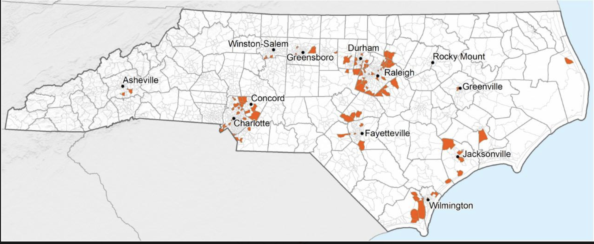
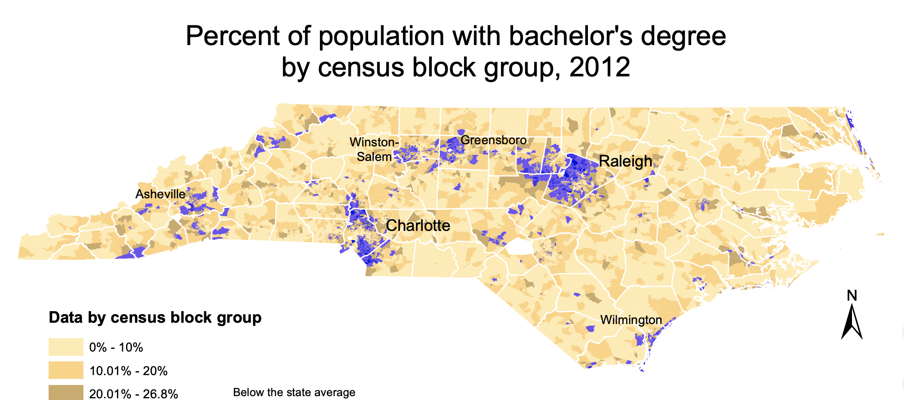
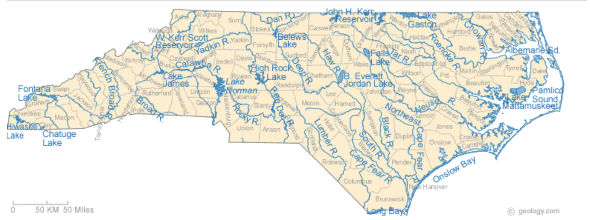
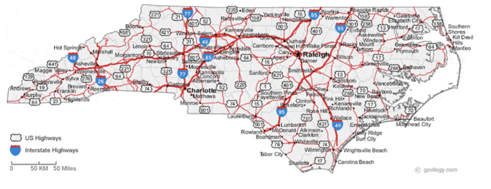
]


---
.pull-left[
# Foundation Data
## Raster (usually)
### Imagery
#### Aerial photos, satellite imagery
### Elevation/terrain
#### Digital Elevation Model
### Land cover/use
]
.pull-right[
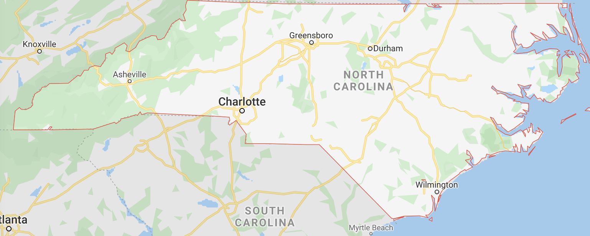
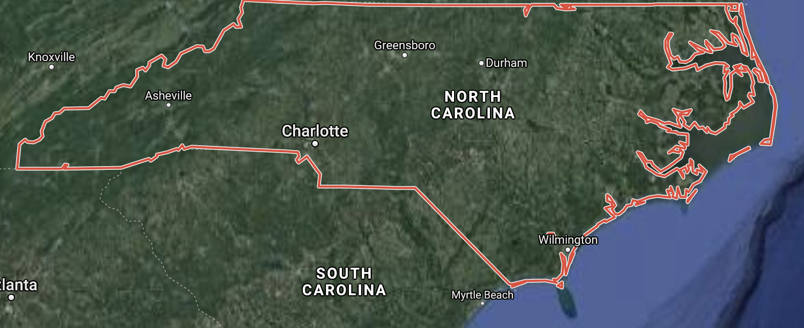
```{r out.width="200px",out.height="`150px",echo = FALSE}
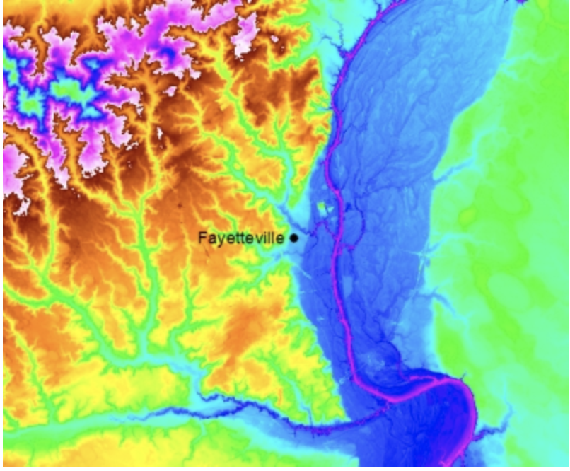
```
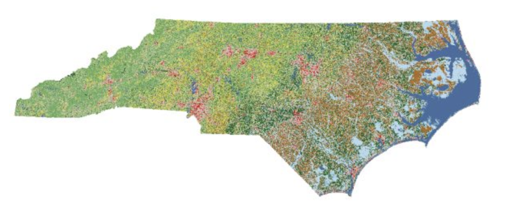
]

---
# Foundation Data
## Creating and/or developing spatial data requires a large amount of time, effort,and money
- ### ***Good news***: a large amount of foundation data has already been created and is freely available on the Internet
- ### ***Bad news***: the availability and quality of this data varies signifcantly from place to place

---
# Demographic Data
## Population attributes
- ### Counts
- ### Age, gender, race/ethnicity, etc.

## Census/survey data
- ### Data resolution and availability will vary
  - #### Generally, higher spatial resolution = less detailed data
  
---
# Socioeconomic Data
## Population attributes
- ### Education, Income, Employment, etc
  - #### Often, used as a proxy for health or health-related behaviors 
  - #### Often, used to assign neighborhood attributes
  
## Census/survey data
- ### Data resolution and availability will vary
  - #### Generally, higher spatial resolution = less detailed data
  
---
# Environ/Neighborhood Data
## Neighborhood attributes
- ### Environmental hazards
  - #### Air pollution, water pollution, etc.
  
- ### Environmental conditions
  - #### Temperature, precipitation, humidity
  
- ### Disease transmission
  - ####Vector distribution (and/or habitat)
  
- ### Amenities
  - #### Neighborhood features
      - ##### Parks, produce stores, etc.
    
---
# Health-related Data
## Vital statistics
- ### Births and deaths

## Morbidity Data
- ### Data about the “health” or “health conditions” in the population
 
## Health care providers
- ### Locations of hospitals, physicians, emergency services, clinics, etc.

##Often, is non-spatial data

---
# Data and information
## Authoritative information
- ### Accuracy/documentation standards and protocols Metadata provided

## Asserted information
- ### Accuracies are undocumented
- ### No metadata
- ### Data about popular places tend to be more accurate
- ### Accuracy can be higher than legacy authoritative data
  
---

# For Example

.pull-left[
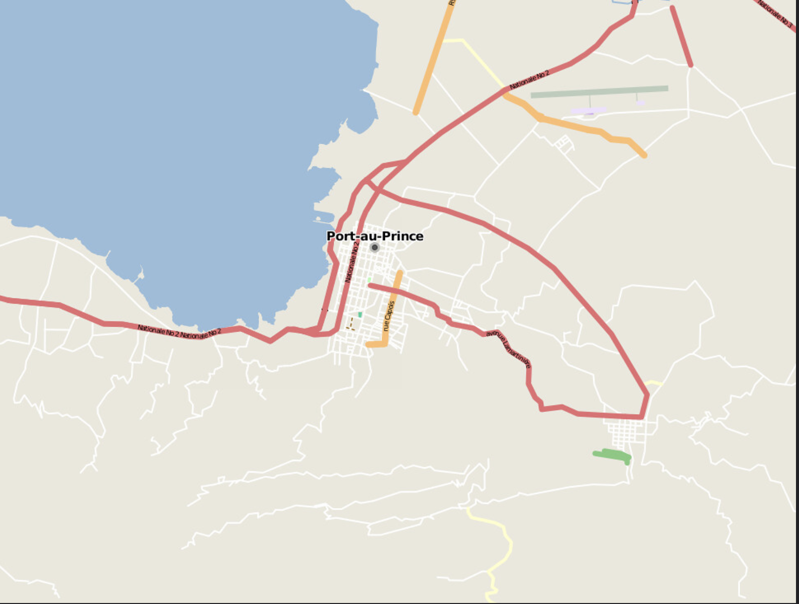
]

--

.pull-right[
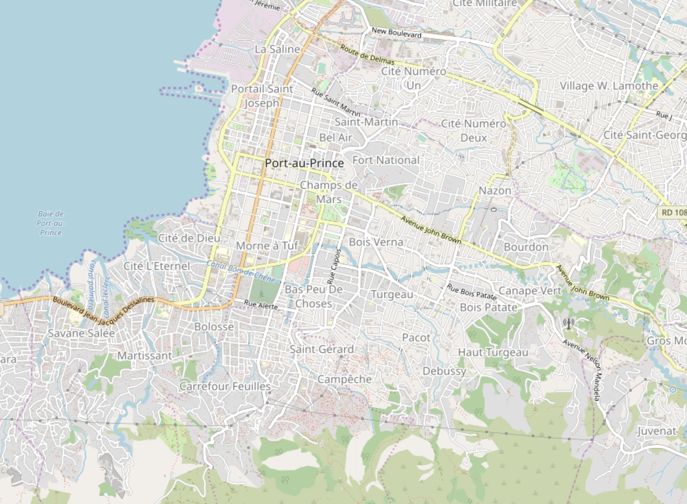
]

---

# For Example
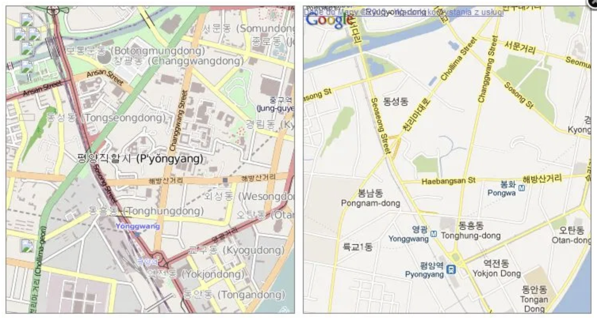

---
# Other Examples

---
# Types of Asserted Communication
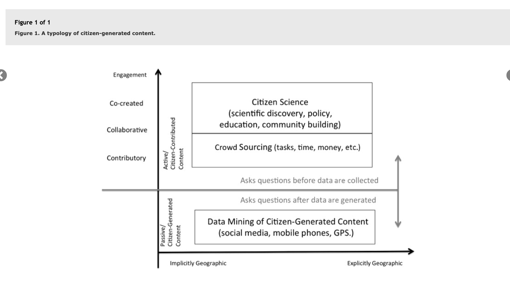

---

# Questions to consider when choosing geospatial data

- ### Where is the data coming from?
- ### Does the data cover the geographic extent I need?
- ### Is the information current?
- ### Is the scale of the data consistent with my other data?
- ### How accurate is the data?
- ### What types of attribute data are available with the data?

.footnote[*Source:*<https://campusguides.lib.utah.edu/c.php?g=160707&p=1052129>]
---
# Questions to consider when choosing geospatial data

- ### How large are the data files?
- ### Is the data properly formatted to open using geospatial software?
- ### Is the data consistently projected?
- ### What metadata accompanies the data?
- ### The major question: Are there any use restrictions for using or accessing the data?

.footnote[*Source:*<https://campusguides.lib.utah.edu/c.php?g=160707&p=1052129>]

---
# Data Acquisition

## Data access and sharing
- ### In the past, data was highly guarded
- ### Movement towards making sharing data via open availability and unrestrictive use arguments

## From secondary sources
- ### Data format
- ### Modes of access

---
# Data Acquisition

## Data Format
- ### Consider whether you can work with data

## Modes of Access
- ### Actual steps to acquire the data
- ### Examples
  - #### Web GIS (Must manually point/click)
  - #### Web links (must manually point/click)
  - #### FTP site (can manually point/click or use automation)
  - #### API (request / response approach)
  - #### Web Scraping / Crawling

---
# Finding Data

## Very important to remember...

- ### Data “existing” in some repository or on the internet is not always analysis-ready
  - #### Often, needs substantial formatting and cleaning before it can be used in an analysis

---

# Finding Data

## The data you want may not be available:
- ### For download via the internet (send an email, make a phone call, file a FIOA) Digitally (paper maps)
- ### At the extent or resolution you need
- ### As spatial data (tabular → join to spatial data)
- ### In a directly useable format (aerial photos / imagery → landcover)

---
# Finding Data
## Like many other tasks...
- ### Explore options 
- ### Be resourceful!
---

# Next Class

## Importing Spatial Data in R using different methods
## Mining and Mapping Twitter Data!
## Complete Data Camp Exercises/ Lab 2
## Complete Poll Everywhere Poll


