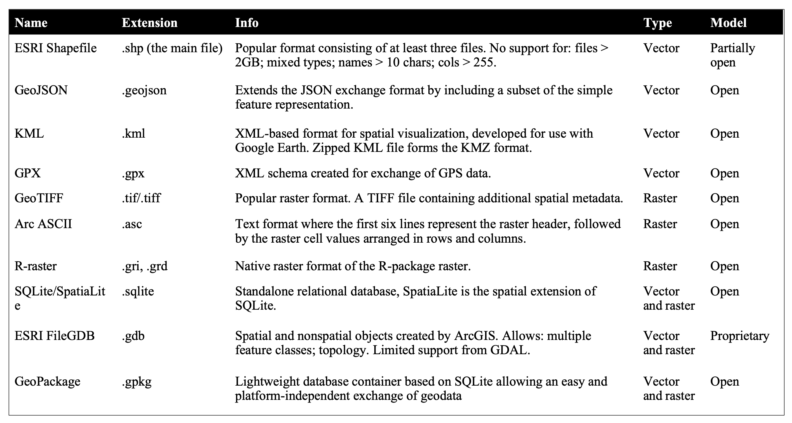
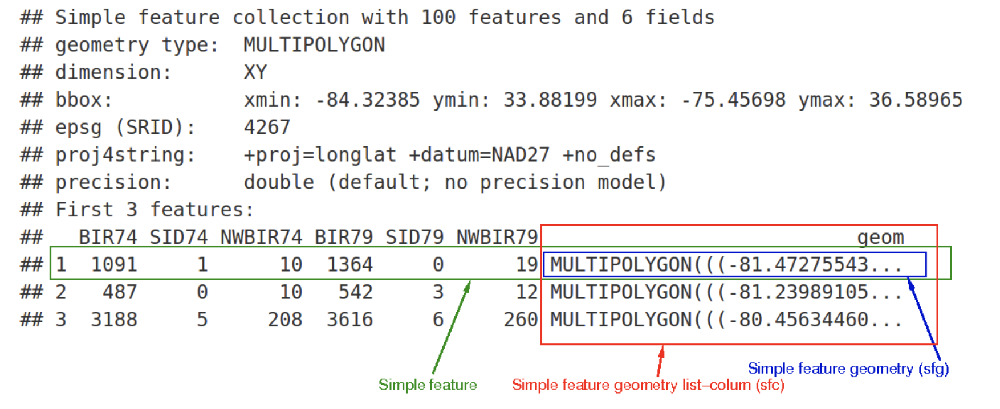
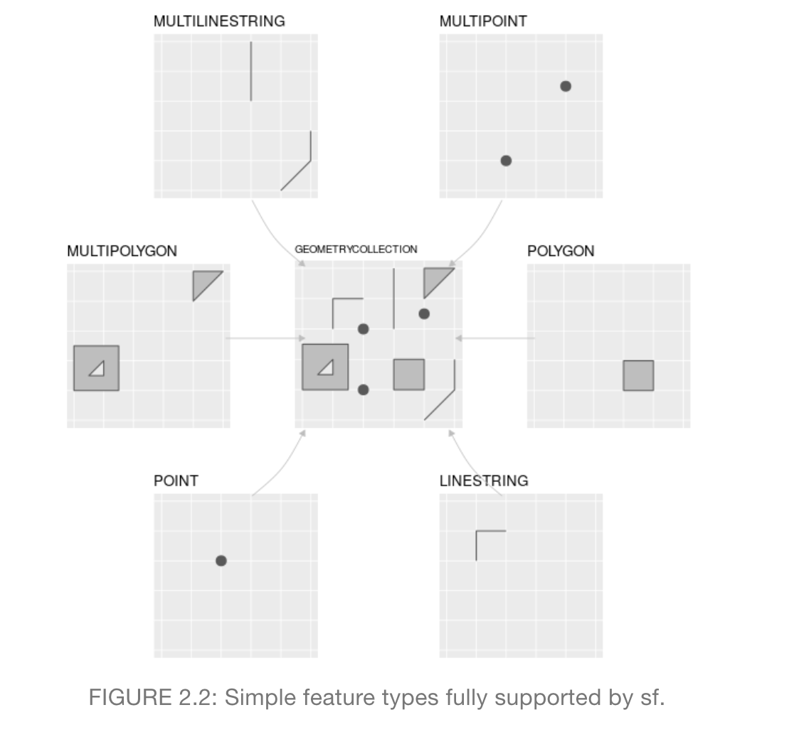

```{r setup, include=FALSE}
#knitr::opts_chunk$set(fig.dim=c(4.8, 4.5), fig.retina=2, out.width="100%")
options(htmltools.dir.version = FALSE)
library(sf)
```

```{r xaringan-themer, include = FALSE}
library(xaringanthemer)
solarized_light(
  header_h1_font_size = "45px",
  header_h2_font_size = "35px",
  header_h3_font_size = "25px",
  text_font_size = "20px",
  text_font_family = "sans-serif",
  header_font_family = "sans-serif",
  text_font_base = "sans-serif",
  text_bold_color = "maroon",
  extra_css = list(
    "h2, h4" = list(
      "color" = "#666666"
      #"line-height" = "0.5em"
),
"h3" = list(
      "color" = "maroon"
),
"h1" = list(
      "color" = "#002b36"
),
"li, p" = list(
     #"padding" = "0 0 0 2em",
     #"margin" = "0",
      "line-height" = "1"
),
".left-code" = list(
  "width" = "38%",
  "height" = "92%",
  "float" = "left"
),
".right-plot" = list(
  "width" = "60%",
  "float" = "right",
  "padding-left" = "1%"
),
"pre" = list(
  "white-space" = "pre-wrap"
)
# "ul, ol, dl" = list(
#      #"padding" = "0 0 0 2em",
#      #"margin" = "0",
#       "line-height" = "1"
# )
)
)
```
class: center, middle

> # *Getting information off the Internet is like taking a drink from a firehose*.
- Mitchell Kapor
---


---
# Spatial Data Packages in R

## `sf` package
- ### `sf` stands for simple features
  - #### describes how objects in the real world can be represented in computers, with emphasis on the spatial geometry of these objects
- ### Implements a commonly used formal standard to describe and store geospatial objects
- ### Imports, exports, manipulate **Vector** Data

---

# Spatial Data Packages in R

## `raster` package
- ### workhorse for importing, exporting and processing **Raster** data in R
- ### Fast and memory efficient
- ### Commonly used in a lot of environmental analysis

---
## Common spatial formats available on the Web


---

# Importing Vector data using `sf`

## From a shapefile on your local disk

```{r import_sf1, eval = FALSE}
nc_geo <- st_read(dsn = "shapefiles/nc.shp", 
                  stringsAsFactors = FALSE)
```

--

```{r plot_import_sf1, ref.label="import_sf1", echo=FALSE}
```

---

# Importing Vector data using `sf`

## structure of vector file in R

```{r import_sf2, eval = FALSE}
str(nc_geo)
```
--
```{r plot_import_sf2, ref.label="import_sf2", echo=FALSE}
```


---
# Importing Vector data using `sf`

## Downloading, unzipping and loading file using code in R

```{r download_sf, eval =FALSE}
#download.file(url = "http://nrdata.nps.gov/programs/lands/nps_boundary.zip",
#              destfile = "nps_boundary.zip")
#unzip(zipfile = "nps_boundary.zip")
usa_parks = st_read(dsn = "temp/Current_Shapes/Data_Store/06-06-12_Posting/nps_boundary.shp")
```
--

```{r plot_download_sf, ref.label="download_sf", echo=FALSE}
```

---
# Importing Vector data using `sf`

## Loading from pre-existing R packages

```{r usepackage1}
library(rnaturalearth)
usa = ne_countries(country = "United States of America") # United States
class(usa)
```
--
```{r usepackage2}
usa_sf = st_as_sf(usa)
class(usa)
```
---
# Dissecting how vectors are stored



---
# Different types of SF geometries



---

# Importing Raster Data

## Importing a single raster file with 1 Layer
```{r}
library(raster)
new_raster <- raster("srtm.tif")
```
--

```{r}
new_raster
```
---
# Importing Raster Data

## Importing a multi-layer raster file

- ### Raster Bricks
```{r}
r_brick = brick("landsat.tif")
```

```{r}
r_brick
```
---
# Importing Raster Data

## Importing a multi-layer raster file

- ### Raster Bricks
```{r}
nlayers(r_brick)
```
# Importing only 1 band
```{r}
band3 <- raster("landsat.tif", band = 3)
```

---

# Importing Raster Data

## Importing a multiple raster files with same extent and resolution

  - ### Raster Stacks
```{r}
tmin_files <- list.files(path = "wc2.0_10m_tmin/", pattern='\\.tif$',full.names = T)
r_stack = stack(tmin_files)
```
---

# Importing Raster Data

## Importing a multiple raster files with same extent and resolution

  - ### Raster Stacks
```{r}
r_stack
```

---

# Creating non-spatial (tabular) data into spatial data

## In-class-exercises

### scraping and mapping twitter data


---
